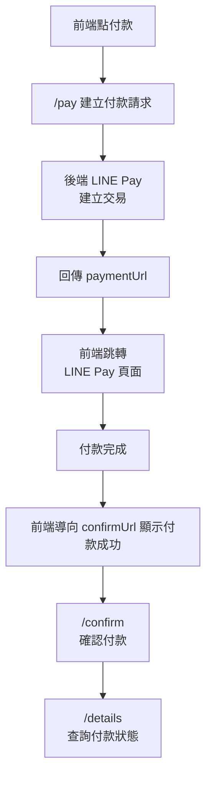

# LINE Pay 串接(Sandbox)


## env
```bash
vi .env
```
```env
LINE_PAY_CHANNEL_ID={你的 LINE PAY 通路 ID}
LINE_PAY_CHANNEL_SECRET={你的 LINE PAY 通路密鑰}
LINE_PAY_CONFIRM_URL={付款成功導向 URL}
LINE_PAY_API_URL=https://sandbox-api-pay.line.me
```
後台管理付款連結 => 管理連結金鑰取 ID & SECRET

## API文件
[LINE Pay API 文件](https://pay.line.me/documents/online_v3_cn.html)

[sandbox](https://developers-pay.line.me/zh/sandbox)

## 流程



